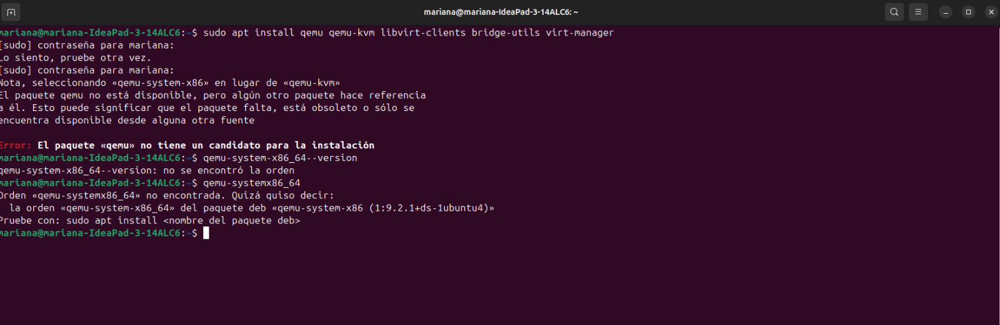
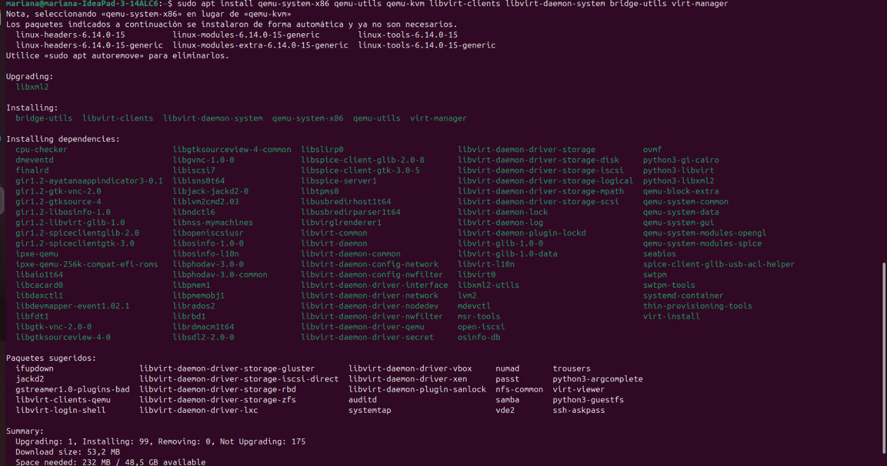
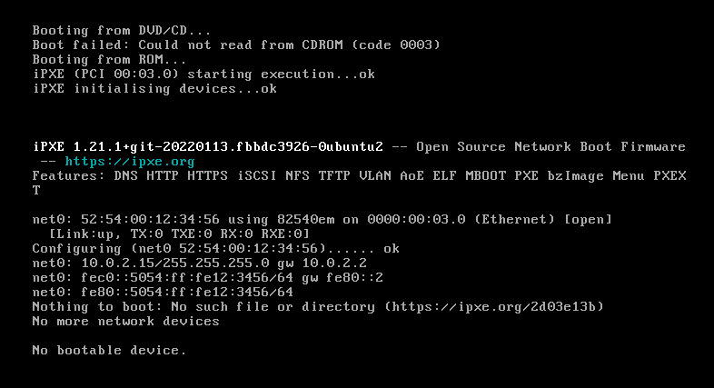
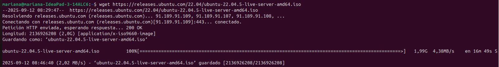
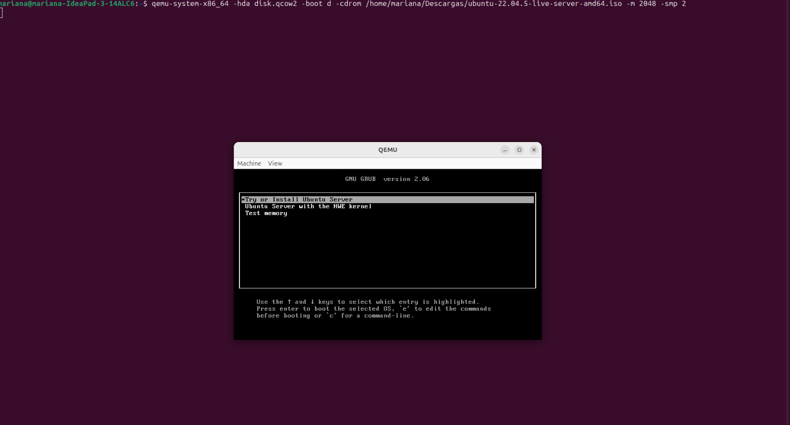
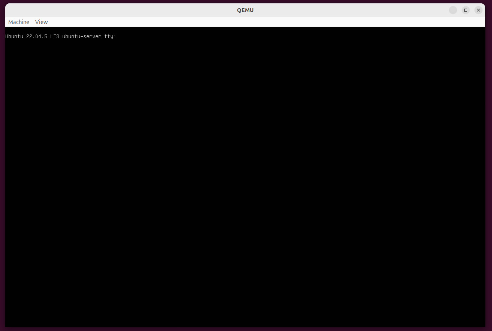
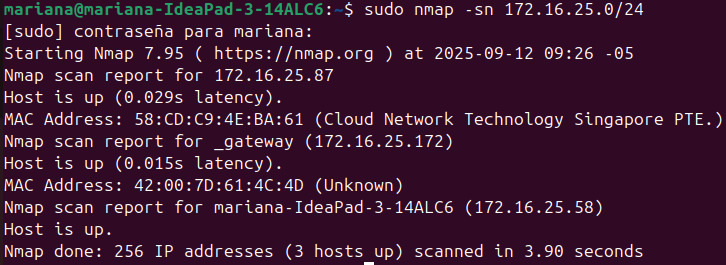
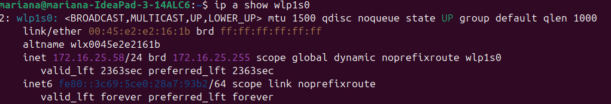

# Tarea 5 - Análisis de Sistemas Operativos Linux y Herramientas de Red

## Descripción del Proyecto
Este repositorio integra una investigación exhaustiva sobre distribuciones Linux empresariales y de uso general, junto con implementaciones prácticas de virtualización usando QEMU y análisis de red mediante Nmap.

## Estructura del Proyecto


## 1. Investigación de Sistemas Operativos Linux

### Distribuciones Empresariales

**Rocky Linux**
- **Historia:** Creado en 2020 por Gregory Kurtzer como sucesor community-driven de CentOS
- **Características:** Compatibilidad binaria con RHEL, estabilidad enterprise-grade
- **Uso:** Servidores corporativos, infraestructura crítica

**AlmaLinux**
- **Historia:** Desarrollado en 2021 por CloudLinux Inc. como alternativa a CentOS
- **Características:** Clon 1:1 de RHEL, soporte a largo plazo
- **Uso:** Migraciones desde CentOS, entornos empresariales

**CentOS Stream**
- **Historia:** Evolución del CentOS tradicional, ahora versión rolling de RHEL
- **Características:** Plataforma de desarrollo para RHEL
- **Uso:** Entornos de testing empresarial

### Distribuciones de Uso General

**Debian**
- **Características:** Estabilidad extrema, sistema APT, múltiples arquitecturas
- **Uso:** Servidores, sistemas embebidos, base para otras distribuciones

**Ubuntu**
- **Características:** LTS cada 2 años, amplio soporte comercial
- **Uso:** Escritorio, cloud, IoT, servidores

**Fedora**
- **Características:** Tecnologías innovadoras, integración con Red Hat
- **Uso:** Desarrollo, estaciones de trabajo

### Distribuciones Especializadas

**Kali Linux**
- **Enfoque:** Seguridad informática y pruebas de penetración
- **Herramientas:** Suite completa para auditorías de seguridad

**Alpine Linux**
- **Características:** Minimalista, seguro, ideal para contenedores
- **Uso:** Docker, sistemas embebidos

## 2. Virtualización con QEMU

### Instalación y Configuración

```bash
# Instalación en sistemas basados en Debian/Ubuntu
sudo apt update
sudo apt install qemu-system-x86 qemu-utils qemu-kvm virt-manager -y

# Verificación de la instalación
qemu-system-x86_64 --version
```
### Imagenes de instalacion 
  
  
  
  
  
  

## 3. Creación de Máquina Virtual
# Crear disco virtual de 20GB
```
qemu-img create -f qcow2 centos_disk.qcow2 20G
```
# Iniciar instalación de CentOS Stream
```
qemu-system-x86_64 \
    -hda centos_disk.qcow2 \
    -cdrom /ruta/CentOS-Stream-10-latest-x86_64-dvd1.iso \
    -boot d \
    -m 4G \
    -smp 2 \
    -vga virtio \
    -display gtk \
    -netdev user,id=net0 \
    -device virtio-net-pci,netdev=net0}
```
## 4. Características de QEMU Implementadas
Virtualización completa de hardware

Soporte para múltiples arquitecturas

Gestión de discos virtuales formatos qcow2/raw

Redes virtuales configurables

Interfaz gráfica y modo headless
### Análisis de Red con Nmap
## 5. Script de Escaneo Automatizado
```
#!/bin/bash
# scripts/nmap_analysis.sh

echo "=== ANÁLISIS COMPLETO DE RED ==="
echo "Fecha: $(date)"
echo
```
# Descubrimiento de hosts activos
```
echo "1. HOSTS ACTIVOS EN LA RED:"
sudo nmap -sn 192.168.1.0/24
```

# Escaneo de puertos en gateway
```
echo "2. ESCANEO DE PUERTOS - ROUTER:"
sudo nmap -sS -sV -p 22,53,80,443,8080 192.168.1.1
```
# Análisis de servicios locales
```
echo "3. ESCANEO LOCAL COMPLETO:"
sudo nmap -sS -sV -sC -O localhost
```
# Detección de vulnerabilidades
```
echo "4. SCRIPTS DE SEGURIDAD:"
sudo nmap --script safe,vuln 192.168.1.1
```
# Escaneo de todos los puertos
```
echo "5. ESCANEO DE PUERTOS 0-1000:"
sudo nmap -p 0-1000 192.168.1.1
```
## 6. Comandos Nmap Explicados
# Descubrimiento de Red
```
nmap -sn 192.168.1.0/24
```
Identifica dispositivos activos sin escanear puertos

Útil para mapeo de red

# Escaneo Stealth
```
nmap -sV 192.168.1.1
```
nmap -sV 192.168.1.1Identifica versión de servicios ejecutándose

Crucial para análisis de seguridad

# Scripts de NSE

```
nmap --script safe 192.168.1.1
```
Ejecuta scripts de seguridad

Detecta configuraciones vulnerables

### Imagens de prueba 
  
  

